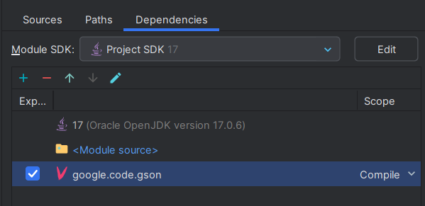
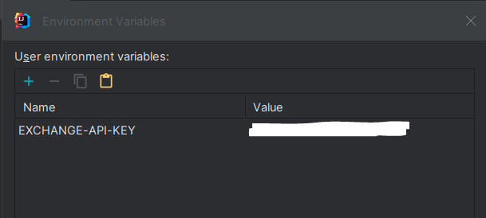

# Conversor de Monedas

Este proyecto es un conversor de monedas desarrollado en Java. Permite a los usuarios convertir una cantidad de una moneda a otra.

## Funcionalidades

1. **Realizar una conversión de moneda**: Esta funcionalidad permite a los usuarios convertir una cantidad de una moneda a otra. Los usuarios deben ingresar el índice de la moneda base y el índice de la moneda objetivo.

2. **Ver el listado actual de monedas**: Esta funcionalidad muestra todas las monedas disponibles para la conversión.

3. **Agregar una moneda al listado**: Esta funcionalidad permite a los usuarios añadir una nueva moneda a la lista de monedas disponibles.

4. **Eliminar una moneda del listado**: Esta funcionalidad permite a los usuarios eliminar una moneda de la lista de monedas disponibles.

5. **Salir**: Esta funcionalidad cierra la aplicación.

## Cómo usar

1. Agrega la libreria GSON al proyecto, esta permite la serialización y deserialización entre objetos Java y su representación en notación JSON.

2. Agregar la variable de entorno con la clave de la API para obtener el valor de las monedas actuales.

3. Ejecuta el archivo `Main.java` para iniciar la aplicación.
4. Se le presentará un menú con las opciones disponibles.
5. Seleccione una opción ingresando el número correspondiente.
6. Siga las instrucciones en pantalla para cada opción.

## Validaciones

El proyecto incluye una serie de validaciones para garantizar que los usuarios ingresen datos válidos. Por ejemplo, se verifica que los índices de las monedas base y objetivo no sean iguales y que estén dentro del rango permitido. También se verifica que la lista de monedas tenga al menos dos elementos antes de permitir que se elimine una moneda.

## Futuras Mejoras

Este proyecto está en desarrollo activo y se planean varias mejoras, como la posibilidad de guardar el historial de conversiones de monedas y la implementación de una interfaz gráfica de usuario.